# 🎫 Ticketing Web Application

A fully functional ticketing system built with **Laravel** and **Bootstrap**, providing an efficient platform for users to submit issues and for administrators to manage and resolve tickets.

🛠️ Developed independently, this project showcases my ability to deliver both backend and frontend functionalities using Laravel’s features, RESTful practices, image APIs, and dashboard visualizations.

---

## 📌 Table of Contents

- [Features](#features)
- [User Roles](#user-roles)
- [Screenshots](#screenshots)
- [Video Demo](#video-demo)
- [Tech Stack](#tech-stack)
- [Installation](#installation)

---

## ✨ Features

### 👤 User Features

- **User Authentication**  
  Users can register, log in, and securely access their personalized dashboard.

- **Ticket Management**  
  - Create and submit new tickets  
  - Edit or cancel tickets (if status is “waiting”)  
  - View personal ticket history  
  - Receive and view feedback from admins  

- **Profile Management**  
  Update personal information and upload a profile photo.

- **Dashboard Overview**  
  View summary statistics and ticket statuses directly from the dashboard.

- **Employee Directory**  
  View a list of all employees and their detailed profiles. Only Super Admins/CEOs can edit or delete these records.

### 🛠️ Admin Features

- **Admin Dashboard**  
  Overview of ticket statuses and user activity.

- **Ticket Management**  
  - View all submitted tickets  
  - Mark tickets as solved  
  - Provide feedback to users  
  - Delete tickets (solved or cancelled)

- **User Management**  
  - Update user profiles  
  - Promote/demote users (to IT Employee or CEO roles)

### ➕ Additional Functionalities

- 📊 **Chart Generation**: Visualize ticket and user data  
- 🖼️ **Image Upload**: Upload and manage profile pictures  
- 🔍 **Unsplash API Integration**: Search and display images dynamically

---

## 👥 User Roles

- **User** – Submit tickets, view feedback, update profile
- **Admin** – Manage tickets and update users
- **Super Admin/CEO** – Full access to promote/demote, edit/delete users and employees

---

## 🖼️ Screenshots

| Name                  | Description                                                                 | Preview                                  |
|-----------------------|-----------------------------------------------------------------------------|------------------------------------------|
| Sign Up               | Users need to sign up to create an account                                 | 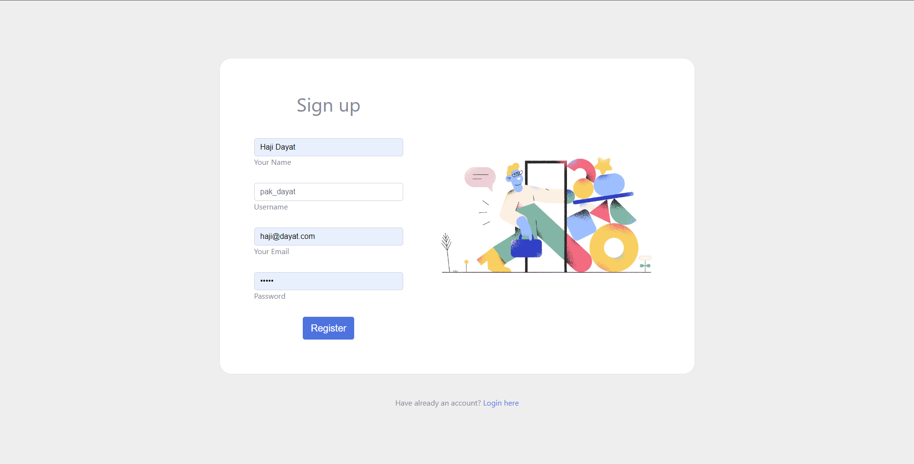                  |
| Log In                | Users log in before accessing the dashboard                                 | 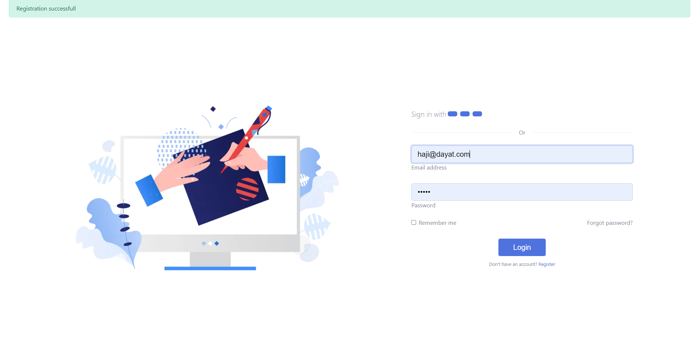                     |
| Dashboard             | Users view their ticket summaries                                           | 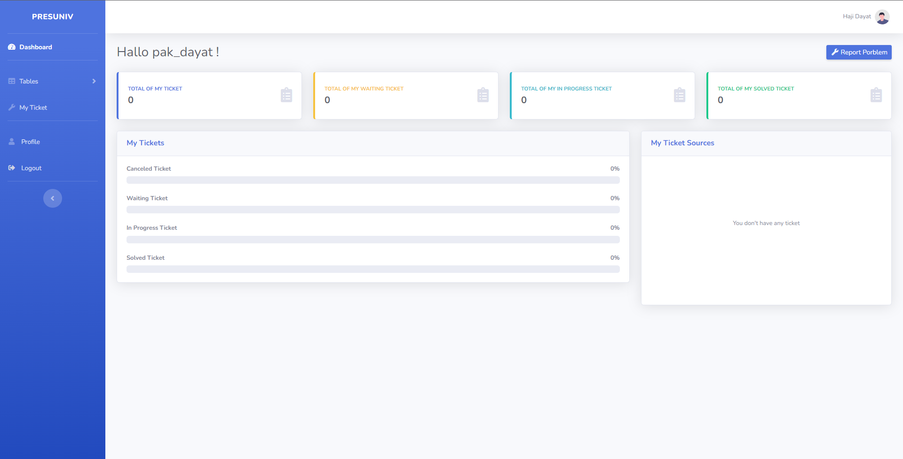             |
| Profile               | Users can update their profile and photo                                    | 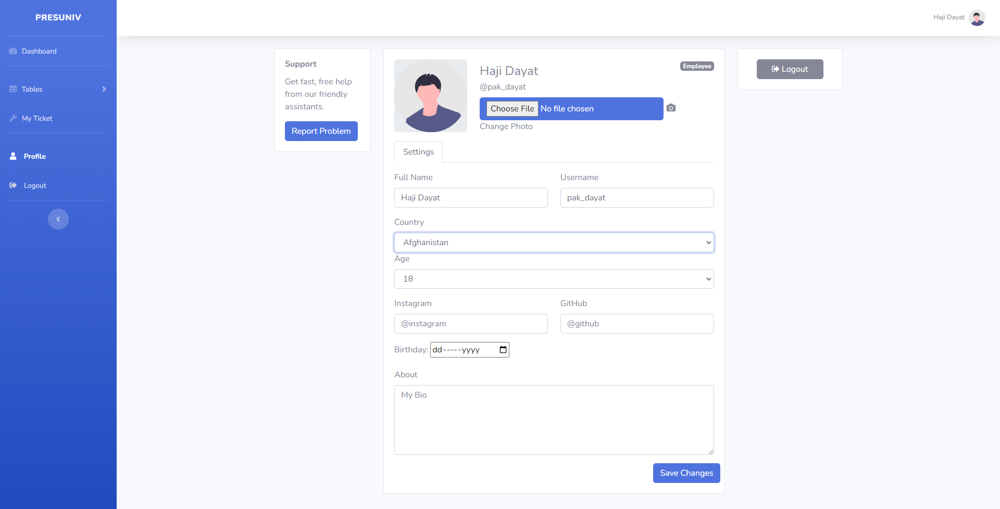               |
| Employee Table        | Shows all employees in the system                                           | 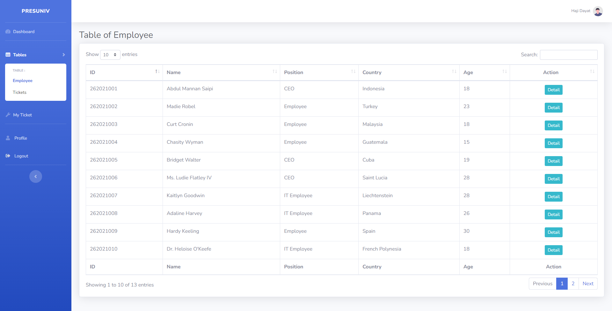              |
| Employee Details      | View employee info (edit/delete only by CEO)                               | 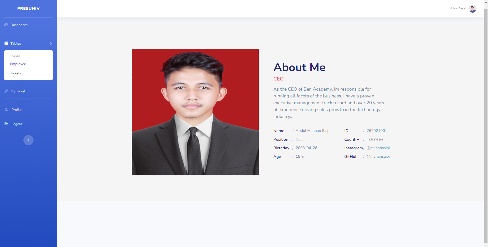       |
| All Tickets           | Displays all ticket records                                                 | 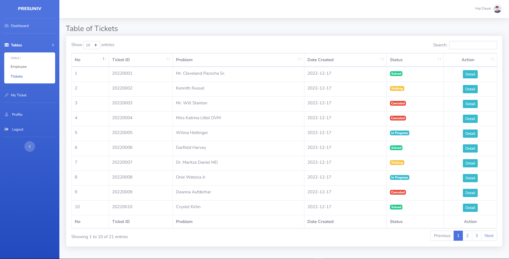          |
| My Tickets            | Users' own ticket list (empty if none created)                             | 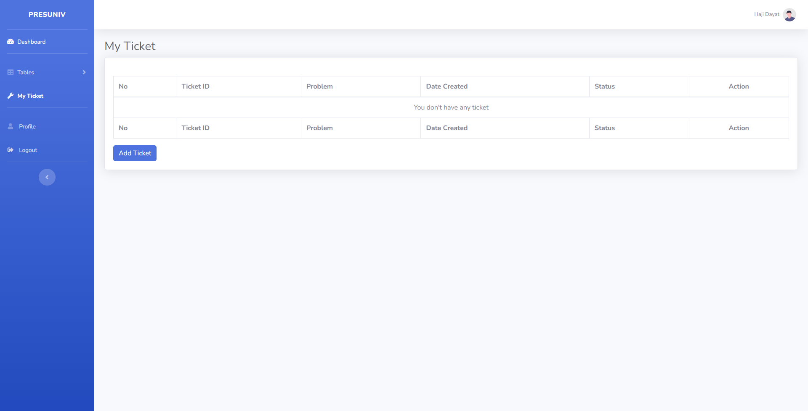                 |
| Create Ticket         | Report an issue to IT/CEO                                                   | 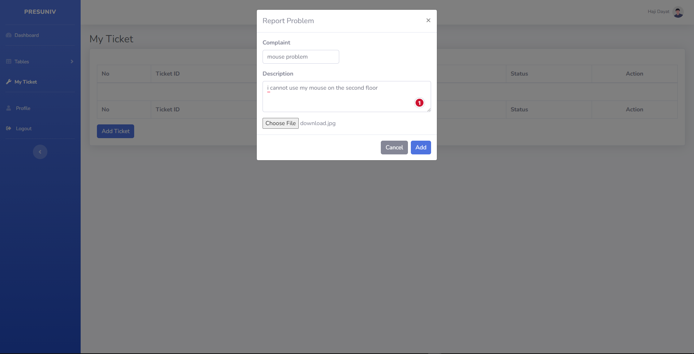               |
| Ticket Submitted      | Users see new tickets after creation                                        | 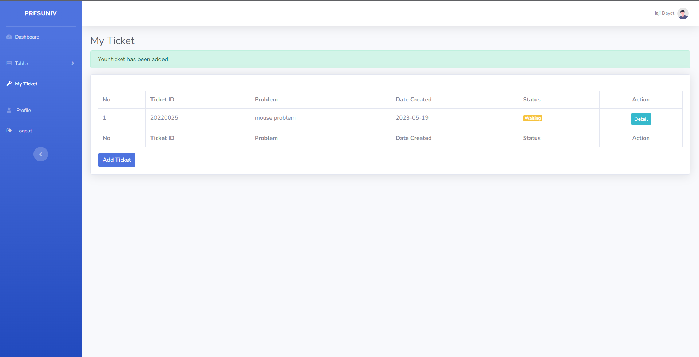            |
| Edit/Cancel Ticket    | Users can edit tickets if still waiting                                     | 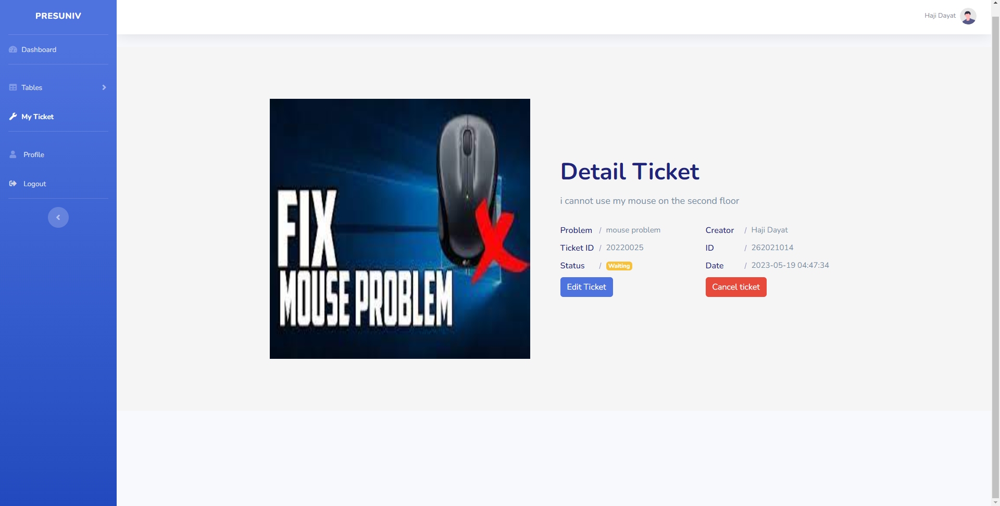               |
| Dashboard Summary     | Users get status updates after admin response                              | 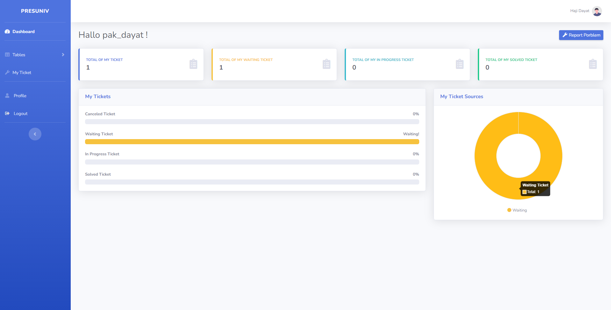            |
| Admin Dashboard       | Admin sees system-wide ticket overview                                      | 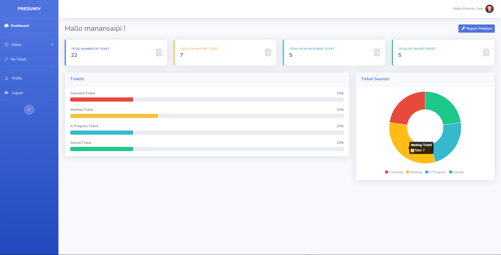           |
| Update User Profile   | Admin can update or delete user accounts                                   | 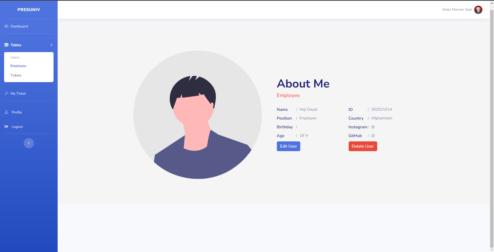    |
| Promote User          | Promote users to IT or CEO                                                  | 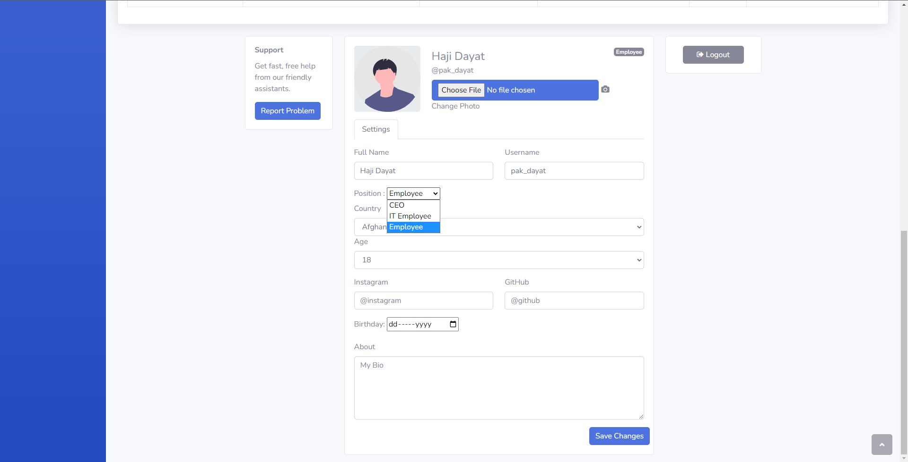              |
| Ticket Management     | Admins solve tickets from the admin panel                                   | 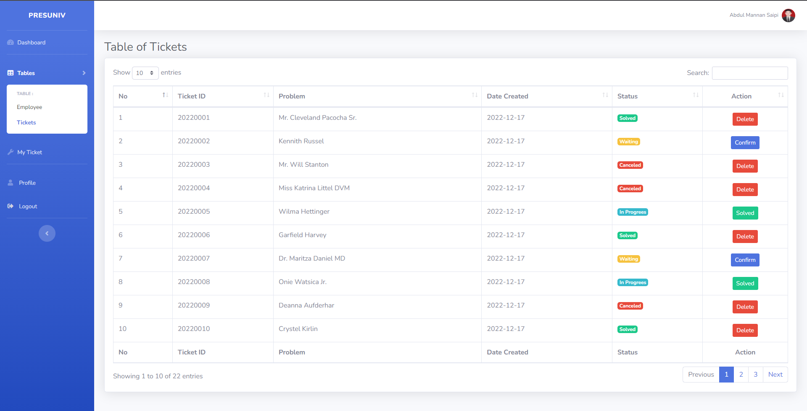              |
| Solve & Feedback      | Admins mark as solved and provide feedback                                 | 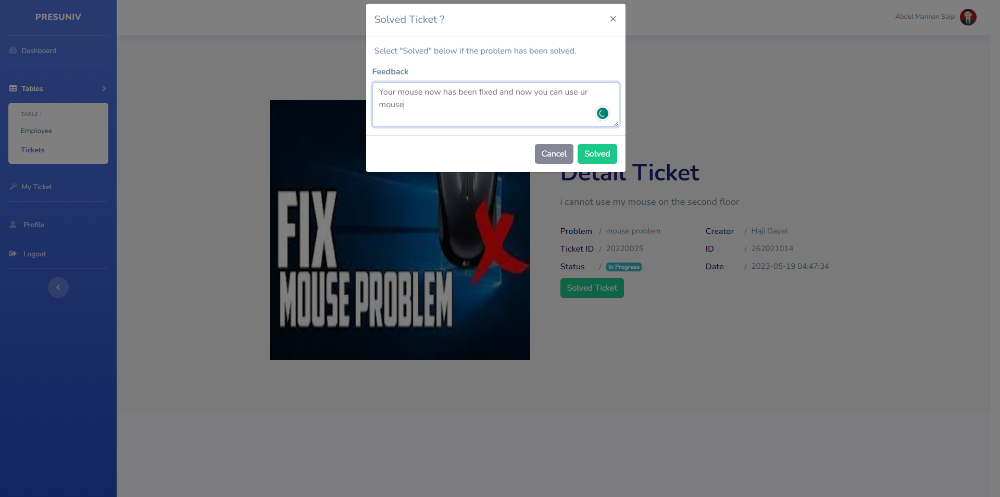             |
| Status Update         | Ticket status changes visible in user dashboard                            | 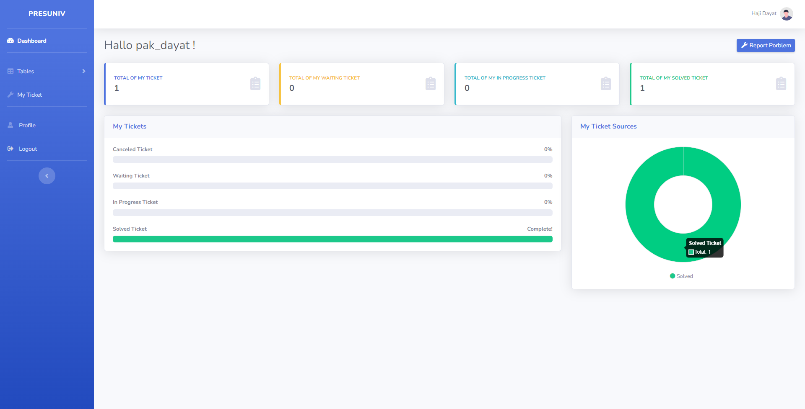            |
| View Feedback         | Users see admin feedback per ticket                                         | 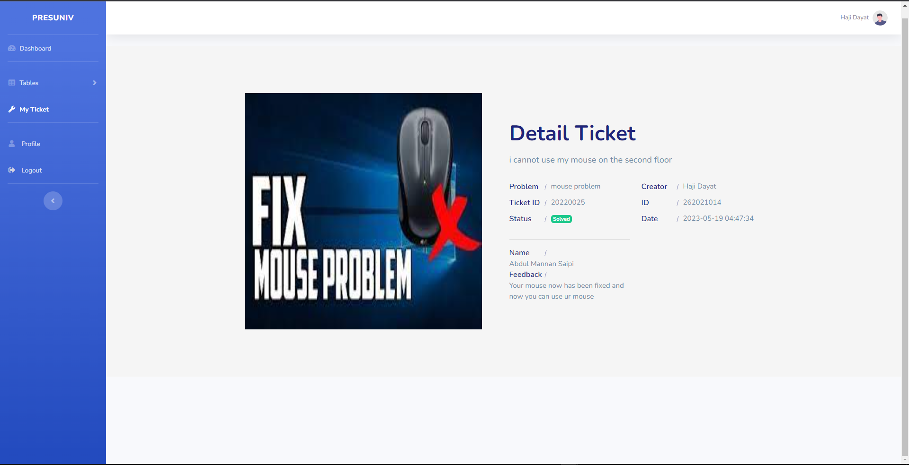              |
| Delete Ticket         | Admin deletes cancelled or solved tickets                                  | 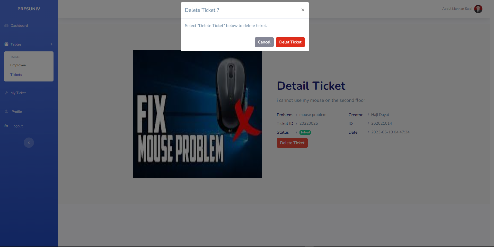             |

---

## 📽️ Video Demo

[](https://drive.google.com/file/d/11ZjAQnNHXwOAOayjev5PypllmgN1MXXl/view?usp=sharing)

---

## 🧰 Tech Stack

| Category     | Technology              |
|--------------|--------------------------|
| Backend      | Laravel (PHP Framework) |
| Frontend     | Blade, Bootstrap        |
| Database     | MySQL                   |
| Charting     | Chart.js, Laravel Charts|
| Deployment   | Google Cloud Run        |
| Image API    | Unsplash API            |

---

## ⚙️ Installation

To set up and run the project locally:

1. **Clone the repository**
   ```bash
   git clone https://github.com/manansaipi/TicketingWebApplication-v2.git
   cd ticketing-app

2. **Install dependencies**

   ```bash
   composer install
   npm install && npm run dev

3. **Copy `.env` and generate key**

   ```bash
   cp .env.example .env
   php artisan key:generate

4. **Configure environment**

   Open the `.env` file and set the necessary environment variables:

   ```env
   APP_NAME=Laravel
   APP_ENV=local
   APP_DEBUG=true
   APP_URL=http://localhost

   DB_CONNECTION=mysql
   DB_HOST=127.0.0.1
   DB_PORT=3306
   DB_DATABASE=finalssip
   DB_USERNAME=root
   DB_PASSWORD=

   MAIL_MAILER=smtp
   MAIL_HOST=mailhog
   MAIL_PORT=1025
   MAIL_USERNAME=null
   MAIL_PASSWORD=null
   MAIL_ENCRYPTION=null
   MAIL_FROM_ADDRESS="hello@example.com"
   MAIL_FROM_NAME="${APP_NAME}"

   # Optional: AWS, Redis, or Pusher settings
5. **Run migrations & seeders**

   This will create all necessary tables in your database and populate them with default data (if seeders are available):

   ```bash
   php artisan migrate --seed
6. **Serve the application locally**

   Start the Laravel development server:

   ```bash
   php artisan serve


